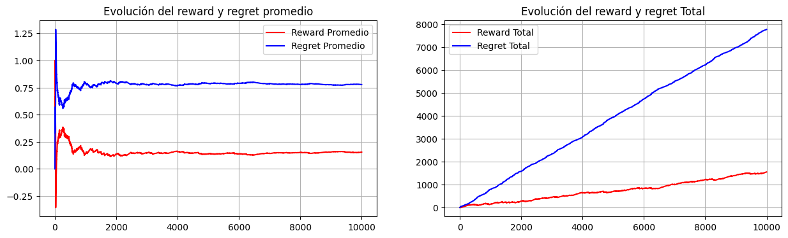
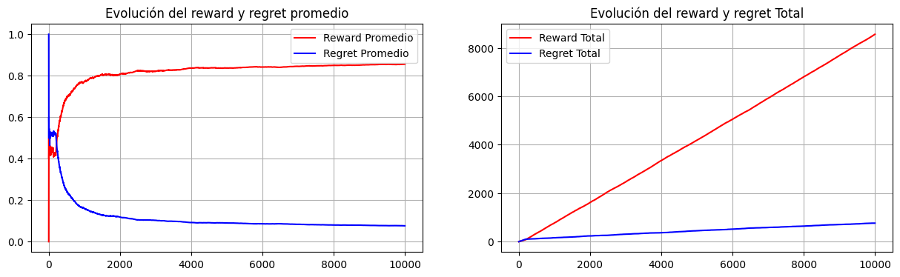
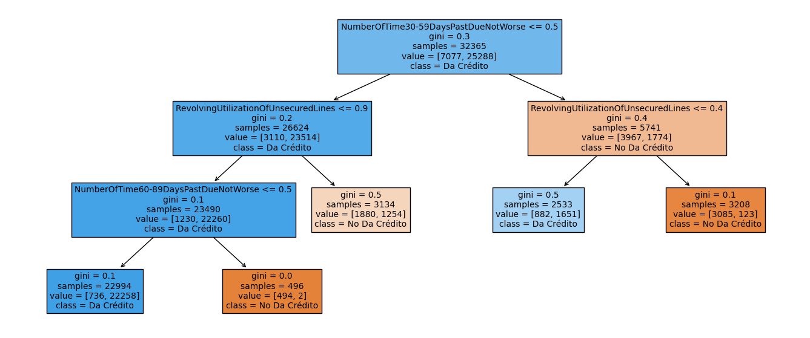

# Multi-Armed Bandits for Credit Scoring

This project employs Multi-Armed Bandit (MAB) approaches for credit scoring. Specifically, a reinforcement learning agent is designed to learn how to allocate credit to clients, considering both contextual and non-contextual MABs.

## Key Concepts

### Contextual Multi-Armed Bandits

Contextual Multi-Armed Bandits (CMAB) consider additional information (context) about the environment or the user when making decisions. In credit scoring, this means taking into account various features of the clients, such as their credit history, income, and other relevant data, to make more informed decisions about granting credit.

- **Contextual Information:** Utilizes client-specific features.
- **Decision Making:** Considers the context to improve prediction accuracy and performance.
- **Performance Metrics:** Typically shows higher rewards and lower regret compared to non-contextual methods.

### Non-Contextual Multi-Armed Bandits

Non-Contextual Multi-Armed Bandits do not use any additional information about the environment or the user. Decisions are made purely based on the rewards received from previous actions, without considering specific attributes of the clients.

- **No Contextual Information:** Decisions are made without additional client data.
- **Simpler Model:** Easier to implement but often less effective.
- **Performance Metrics:** Generally shows lower rewards and higher regret compared to contextual methods.

## Performance

#### Random Algorithm

Initially, a random algorithm is used to grant credit, serving as a baseline for performance comparison.

- **Mean Reward:** 0.1548
- **Mean Regret:** 0.7775

 

#### Linear Contextual Multi-Armed Bandit

Implementing a linear contextual multi-armed bandit significantly improves the agent's performance in credit allocation.

- **Mean Reward:** 0.8559
- **Mean Regret:** 0.0764

 

- **Surrogate Model:** To understand the behavior of the model, a surrogate model is created. This model helps identify the variables that are considered important when deciding whether to grant credit.

 

 

